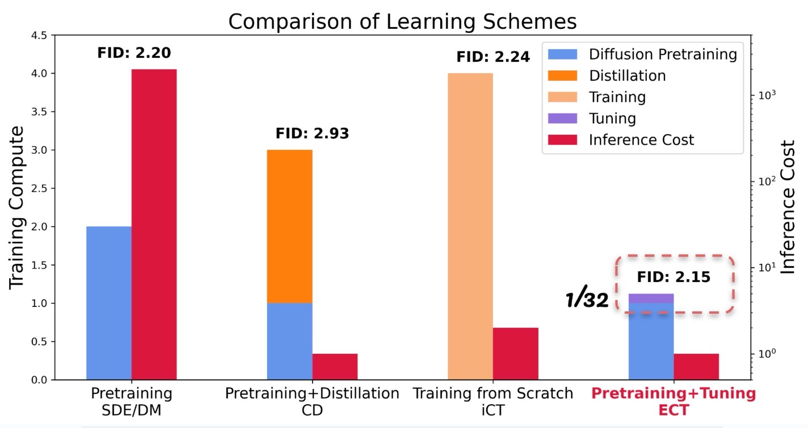

# ECT: Consistency Models Made Easy

Pytorch implementation for [Easy Consistency Tuning (ECT)](https://www.notion.so/gsunshine/Consistency-Models-Made-Easy-954205c0b4a24c009f78719f43b419cc).

ECT unlocks SoTA few-step generative abilities through a simple yet principled approach. With just a negligible tuning cost, ECT demonstrates promising early results while benefiting from the scaling in training FLOPs to continuously enhance its few-step generation capability.

Try your own [Consistency Models](https://arxiv.org/abs/2303.01469)! You only need to fine-tune a bit. :D

<div align="center">
    
</div>

## ⭐ Update ⭐

Baking more in the oven. 🙃 

- **2024.04.27** - Upgrade environment to Pytorch 2.3.0.
- **2024.04.12** - ECMs can now surpass SoTA GANs using 1 model step and SoTA Diffusion Models using 2 model steps on CIFAR10. Checkpoints available.

## Environment

You can run the following command to set up the Python environment through `conda`. 
Pytorch 2.3.0 and Python 3.9.18 will be installed.

```bash
conda env create -f env.yml
```

## Datasets

Prepare the dataset to the EDM's format. See a reference [here](https://github.com/NVlabs/edm?tab=readme-ov-file#preparing-datasets).

## Training

Run the following command to run ECT at batch size 128 and 200k iterations. NGPUs=2/4 is recommended. 

```bash
bash run_ecm.sh <NGPUs> <PORT> --desc bs128.200k
```

Replace NGPUs and PORT with the number of GPUs used for training and the port number for DDP sync.

## Evaluation

Run the following command to calculate FID of a pretrained checkpoint. 

```bash
bash eval_ecm.sh <NGPUs> <PORT> --resume <CKPT_PATH> 
```

## Generative Performance

### FID Evaluation


Taking the models trained by ECT as ECM, we compare ECMs' unconditional image generation capabilities with SoTA generative models on the CIFAR10 dataset, including popular diffusion models w/ advanced samplers, diffusion distillations, and consistency models on the CIFAR10 dataset.

| Method | FID | NFE | Model  | Params | Batch Size | Schedule |
| :----  | :-- | :-- |:----   | :----- | :--------- | :------- |
| Score SDE | 2.38 | 2000 | NCSN++ | 56.4M | 128 | ~1600k | 
| Score SDE-deep | 2.20 | 2000 | NCSN++ (2 $\times$ depth) | > 100M | 128 | ~1600k |
| EDM                | 2.01 | 35 | DDPM++ | 56.4M | 512 | 400k |
| PD                 | 8.34 | 1  | DDPM++ | 56.4M | 512 | 800k | 
| Diff-Instruct      | 4.53 | 1  | DDPM++ | 56.4M | 512 | 800k | 
| CD (LPIPS)         | 3.55 | 1  | NCSN++ | 56.4M | 512 | 800k | 
| CD (LPIPS)         | 2.93 | 2  | NCSN++ | 56.4M | 512 | 800k | 
| iCT-deep           | 2.51 | 1  | NCSN++ (2 $\times$ depth) | > 100M | 1024 | 400k | 
| iCT-deep           | 2.24 | 2  | NCSN++ (2 $\times$ depth) | > 100M | 1024 | 400k | 
| ECM (100k)         | 4.54 | 1  | DDPM++ | 55.7M | 128 | 100k |
| ECM (200k)         | 3.86 | 1  | DDPM++ | 55.7M | 128 | 200k |
| ECM (400k)         | 3.60 | 1  | DDPM++ | 55.7M | 128 | 400k |
| ECM (100k)         | 2.20 | 2  | DDPM++ | 55.7M | 128 | 100k | 
| ECM (200k)         | 2.15 | 2  | DDPM++ | 55.7M | 128 | 200k | 
| ECM (400k)         | 2.11 | 2  | DDPM++ | 55.7M | 128 | 400k | 

### $\mathrm{FD}_{\text{DINOv2}}$ Evaluation

Since DINOv2 could produce evaluation better aligned with human vision, we evaluate the image fidelity using Fréchet Distance in the latent space of SoTA open-source representation model DINOv2, denoted as 
$\mathrm{FD}_{\text{DINOv2}}$.

---

Using [dgm-eval](https://github.com/layer6ai-labs/dgm-eval/tree/master), we have $\mathrm{FD}_{\text{DINOv2}}$ against SoTA Diffusion Models and GANs.

| Method |  $\mathrm{FD}_{\text{DINOv2}}$  | NFE | 
| :----  |  :-- | :-- |
| [EDM](https://github.com/NVlabs/edm)                                        | 145.20 | 35  |
| [StyleGAN-XL](https://github.com/autonomousvision/stylegan-xl/tree/main)    | 204.60 | 1   |
ECM                                                                           | 198.51 | 1   | 
ECM                                                                           | 128.63 | 2   |

Even without combining with other generative mechanisms like GANs or diffusion distillation like Score Distillation, ECT is capable of generating high-quality samples much faster than SoTA diffusion models and much better than ~~SoTA GANs~~ SoTA Diffusion Models and GANs.

## Checkpoints

More checkpoints will be available later.

- CIFAR10 $\mathrm{FD}_{\text{DINOv2}}$ [checkpoint](https://drive.google.com/file/d/1WN_eLTrcl-vB7fMc1HADpacgcO4SNJ_1/view?usp=sharing).

## Contact

Please drop me an email at zhengyanggeng@gmail.com if you'd like to train models together!!!

Feel free to contact me if you have additional questions or have interests in collaboration. Find me at [Twitter](https://twitter.com/ZhengyangGeng) or [WeChat](https://github.com/Gsunshine/Enjoy-Hamburger/blob/main/assets/WeChat.jpg). :D

## Citation

```bibtex
@misc{ect,
    title  = {Consistency Models Made Easy},
    author = {Geng, Zhengyang and Luo, William and Pokle, Ashwini and Kolter, Zico},
    year   = {2024},
    url    = {https://gsunshine.notion.site/Consistency-Models-Made-Easy-954205c0b4a24c009f78719f43b419cc?pvs=4}
}
```
